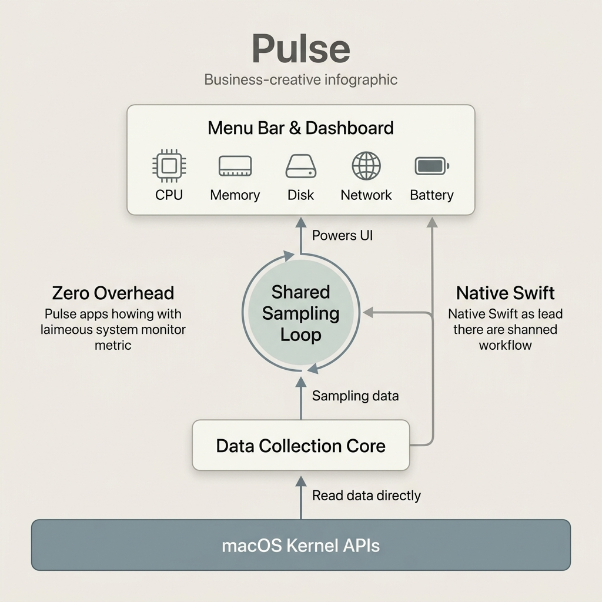

<div align="center">


**Native macOS system monitor — CPU, memory, disk, network & battery in one menu bar app.**

[](https://github.com/VenkateshDas/pulse/releases)
[](https://swift.org)
[](https://github.com/VenkateshDas/pulse/releases/latest)
[](LICENSE)

[**Website**](https://venkateshdas.github.io/pulse/) · [**Download for Mac →**](https://github.com/VenkateshDas/pulse/releases/latest)

</div>

---

> [!WARNING]
> **Work in progress.** Pulse is under active development — expect rough edges, bugs, and breaking changes. Things may be glitchy. Feedback welcome.

> **Beta note:** Pulse is ad-hoc signed, no notarization or signing secrets configured yet. Releases are unsigned DMGs — Gatekeeper blocks them on other Macs (see Install below).

---

## Features

- **Simple / Pro display mode** — Simple leads with plain-language verdicts and gates jargon (load average, per-core splits, process tables) behind an explicit "show details" tap; Pro shows the full instrument panel. Switch anytime in Settings; a sensible default is picked based on whether you've already been through onboarding.
- **Diagnosis verdict** — one line telling you what's wrong and who's to blame ("Chrome high CPU"), with a tap-through to the culprit process. Shown on the Dashboard, in the menu-bar HUD, and logged to history.
- **Health score** — a single 0–100 score (CPU, memory, disk, thermal) with a per-factor "what's costing you" breakdown.
- **Menu bar HUD** — live score + verdict, CPU/memory/disk/battery vitals at a glance, and a brief action-icon flash (e.g. trash, sync, sun) when a hotkey or popover button fires — feedback even when the popover is closed.
- **Global keyboard shortcuts** — 5 hotkeys dispatch straight to the same actions the popover buttons use: run Optimize, empty Trash (with confirmation), toggle brightness sync, toggle Keep Awake, toggle the menu-bar chevron/auto-hide. Configurable in Settings.
- **Dashboard** — real-time charts, per-core CPU heatmap, top processes by CPU/memory.
- **Theme presets** — four built-in palettes (Precision, Midnight, Contrast, Slate) applied app-wide across the Command Center and popover, picked in Settings.
- **Disk** — one unified view with sub-tabs:
  - **Map** — treemap of disk usage.
  - **Hidden Space** — surfaces big, easy-to-forget locations (iOS backups, Xcode DerivedData/simulators, Docker/OrbStack, dev caches, Downloads >90 days), flagged 👀 real-data vs cleanable.
  - **Reclaim** — safety-graded scan for reclaimable space (caches, venvs, `node_modules`).
  - **Growth** — per-folder daily disk growth, no baseline snapshot required — shows where your free space actually went.
  - **"Can I delete this?"** — evidence-based verdict on a file or folder before you remove it: checks whether anything currently has it open or references it, so it stops flagging live data as safe to delete.
  - **Trash** — review and empty.
  - **Optimize** — safe maintenance tasks (QuickLook/DNS/Launch Services), admin tasks via a macOS password prompt (`purge`, network flush, Spotlight reindex), and a "we refuse these 5 risky ops" trust panel.
- **App Uninstaller** — drag an app (or pick from the list); Pulse finds leftover files, grades every match by confidence (exact bundle-ID = safe, vendor/name = careful, weak name = review-only), trashes the app, and shows a receipt. **Orphan scan** finds debris from apps already deleted — including launch agents/daemons that load a now-missing binary.
- **Process watch** — alerts only when a process stays hot for a sustained window (no momentary-spike false alarms), with a searchable anomaly history.
- **Timeline** — daily health journal: disk growth, battery sessions, and sustained-CPU anomalies, with daily disk growth attributed to the folders that caused it.
- **Dev Mode** — process-level sampler with µs-resolution CPU accounting.
- **Reversible by default** — every removal (Smart Clean, Reclaim, Optimize, Uninstall, orphans, Empty Trash hotkey) goes to the Trash, not `rm`, and is logged to a 30-day **Undo history** you can restore from one tap. The journal lives in `~/Library/Application Support/Pulse/`.
- **Low overhead** — ~0.1% CPU while sampling every 2 s; one shared loop feeds every view, so opening more panes adds no samplers. RSS sits around ~110–120 MB — the SwiftUI/AppKit/Charts framework baseline, not Pulse's own data (a few hundred KB of capped ring buffers).

## Install

### Download (recommended)

1. [Download the latest `.dmg`](https://github.com/VenkateshDas/pulse/releases/latest)
2. Open DMG → drag **Pulse** to Applications → **eject the DMG**
3. First launch — the build is not notarized, so macOS blocks it. Two ways through:

   **Terminal (reliable on all versions, incl. macOS Sequoia 15):**
   ```sh
   xattr -cr /Applications/Pulse.app
   open /Applications/Pulse.app
   ```

   **Or via System Settings:** double-click Pulse → click **Done** on the
   "not opened" dialog → **System Settings → Privacy & Security** → scroll to
   **Security** → **Open Anyway** → authenticate.

> On **macOS Sequoia (15)** the old "right-click → Open" bypass was removed —
> use one of the two methods above. Run `xattr` on the copy in `/Applications`
> (not the one inside the mounted DMG), or it won't take.
>
> A **notarized** build (no warning at all) is published once Apple Developer
> signing secrets are configured — see [CONTRIBUTING.md](CONTRIBUTING.md#releases-cd).
> MDM-managed work laptops may require notarization and/or IT to allowlist
> `com.pulse.app`.

### Build from source

**Requirements:** macOS 14+, Xcode Command Line Tools

```sh
xcode-select --install          # if not already installed

git clone https://github.com/VenkateshDas/pulse
cd pulse/pulse
make bundle                     # → pulse/dist/Pulse.app
open dist/Pulse.app
```

## Architecture

<!-- <div align="center">
  
</div> -->

| Module | Role |
|--------|------|
| `Sources/PulseKit` | UI-free data collection core. CPU, memory, disk, network, battery, processes. Reads kernel APIs directly — zero subprocess calls. |
| `Sources/CPulse` | C shim bridging `libproc.h` to Swift. |
| `Sources/Pulse` | SwiftUI app — menu bar extra + multi-pane dashboard (HALO design system). |
| `Tests/PulseKitTests` | Swift Testing suite for the collection core. |

## Performance

One shared sampling loop feeds all views. Opening more panes never adds samplers.

| Scenario | CPU | RSS |
|----------|-----|-----|
| Menu bar only | ~0.1% | ~110 MB |
| Dashboard open | ~0.1–0.5% | ~120 MB |

Measured on Apple M2. CPU is the headline number — Pulse holds ~0.1%, so it
ranks at the *top* of a CPU-sorted process list only because everything else on
an idle machine is also near zero; it is not consuming meaningful CPU.

RSS is dominated by the SwiftUI/AppKit/Charts/Metal frameworks, which every
SwiftUI app links — Pulse's own retained data is a few hundred KB (all history
buffers are bounded ring buffers). A lower number isn't reachable without
dropping SwiftUI Charts.

## Build commands

```sh
make build      # debug build
make test       # run test suite
make run        # run from terminal
make bundle     # → pulse/dist/Pulse.app (ad-hoc signed)
make dev-cert   # one-time: stable local signing so TCC grants survive rebuilds
make dmg        # → pulse/dist/Pulse-x.y.z.dmg
```

> **Testing permission-gated features locally (App Uninstaller).** `make bundle`
> ad-hoc signs, which gives the app a new code hash every rebuild — macOS then
> drops any Full Disk Access / App Management grant you made. Run `make dev-cert`
> **once** to create a stable self-signed identity so a granted permission
> persists across rebuilds. To trash an App-Store / root-owned bundle, Pulse
> asks Finder via Apple Events (in-process, no shell), so the first uninstall
> prompts for "control Finder" and, for root-owned apps, an admin password —
> exactly like a manual drag-to-Trash.

## Contributing

Bug reports and feature requests welcome — open an [issue](https://github.com/VenkateshDas/pulse/issues).

Pull requests: open an issue first to discuss the change, then submit a PR against `main`.

## License

MIT — see [LICENSE](LICENSE).
